Тестирование
============

Данная инструкция направлена на быстрое понимание принципов работы с библитекой **rootsLib**,
структуры теста и необходимых инструменов для комфортной работы.

.. note:: Вы можите воспользоваться быстрым Поиском в боковом меню или просто нажать Ctrl+F и ввести искомую информацию.

Структура
=========

Инструменты
-----------
Для тестирования платфомы **Flexbby** используется связка Python 3 + Selenium.

* `Документация Python 3 на русском языке <https://wombat.org.ua/AByteOfPython/toc.html#>`_
* `Документация Selenium на русском языке <http://selenium2.ru/docs.html>`_
* `PyCharm является наиболее удобной средой разработки тестов <https://www.jetbrains.com/pycharm/>`_
* `Примеры написания XPATH и его базовый синтаксис <http://onedev.net/post/458>`_

Структура тестов
----------------
Имя теста должно содержать всю необходимую информацию:

* Имя тестируемого объекта.
* Если имя теста состоит из нескольких слов, то они должны быль заделены знаком "_".
* Суфикс _testing.py в конце имени теста.
* Имя теста не должно содержать знаков верхнего регистра.

.. note:: Если тестируется вложенный объект бокового меню, то имя теста должно содержать префикс с именем родителя.

Структура библиотеки rootsLib
-----------------------------
Данная библиотека создана для того, чтобы сэкономить время на разработку новых тестов. Библиотека может подвергаться изменениям после согласования с ведущим тестировщиком.

Библиотека имеет название коренной папки rootsLib.

Состоит из:

* **roots.py** - файл содержащий все необходимые классы и функции библиотеки для работы с интерфейсом системы Flexbby.
* **content.py** - файл содержащий данные (переменные), необходимые для ввода внутри системы (логины, пароли, названия компаний, ИНН, и т.п.)
* **xpath.py** - файл содержащий набор селекторов необходимых для работы тестов.

.. warning:: Файл **content.py** содержит данные, позволяющие войти внутрь системы Flexbby, потому **не должен** попасть в доступ третьим лицам.

**rootsLib**. Описание
======================
Внутри данной библиотеки файл **roots.py** является основным - содержит все необходимые классы и функции.

printOk
-------
Данная функция выводид переданный текст в консоль в определённом формате. Используется после каждого действия в тесте, чтобы выводить отчёт успешно выполненного действия.

.. code-block:: python

	def printOk(text)

TakeDate
--------
Данный класс используется для того, чтобы проставлять дату в документах.

.. code-block:: python

	class TakeDate:
	today = datetime.date.today()
	tomorrow = today + datetime.timedelta(days=1)
	today = today.strftime("%d.%m.%Y")
	tomorrow = tomorrow.strftime("%d.%m.%Y")

*Например:* "Дата деактивации" и др.

Дата уже имеет формат "dd.mm.yyyy"

TextColors
----------
Данный класс используется для подцветки отдельных фраз и слов при выводе в консоль.

.. code-block:: python

	class TextColors:
	HEADER = '\033[95m'
	OKBLUE = '\033[94m'
	OKGREEN = '\033[92m'
	WARNING = '\033[93m'
	FAIL = '\033[91m'
	ENDC = '\033[0m'
	BOLD = '\033[1m'
	UNDERLINE = '\033[4m'

`Инструкцию по использованию и дополнительные ASCII цвета можно найти тут <http://misc.flogisoft.com/bash/tip_colors_and_formatting>`_

**UITestToolkit**
-----------------
.. note:: Данный класс содержит основную логику rootsLib.
.. code-block:: python

	class UITestToolkit(object)

_init_
~~~~~~

.. code-block:: python

	def __init__(self):
		self.driver = webdriver.Chrome()
		self.driver.maximize_window()
		self.wait = WebDriverWait(self.driver, 150)
		self.action = action_chains.ActionChains(self.driver)

Инициализирует webdriver.
Именно тут определяется в каком браузере будет выполняться тестирование.

.. code-block:: python

	self.driver = webdriver.Chrome()

Разворачивает окно браузер на весь экран.

.. code-block:: python

	self.driver.maximize_window()

Устанавливает значение WebDriverWait, который отвечает за ожидание при рабоет с элементами на странице.

.. code-block:: python

	self.wait = WebDriverWait(self.driver, 150)

Инициализирует ActionChains, которая отвечает за симуляцию клавиатуры и мыши.

.. code-block:: python

	self.action = action_chains.ActionChains(self.driver)

addActivity
~~~~~~~~~~~
Добавляет "маленькую" активность внутри объекта (применяется в Юр.лицах), после чего заполняет необходимые данные и удаляет её.

.. code-block:: python

	def addActivity()

addBankAccount
~~~~~~~~~~~~~~
Функция проставляет значения в разделе "Банковские Реквизиты", используя  **createSimpleObject** и ****kwargs**

.. code-block:: python

	def addBankAccount(self):
		self.createSimpleObject(
			bik='044525225',
			nameForeign='SBERBANK',
			inn='7707083893',
			kpp='773601001',
			accountNumber='30301810000006000001',
			personalAccount='30301810000006000002',
			comment='Test comment',
			deactivateDate=TakeDate.tomorrow
		)

addComment
~~~~~~~~~~
Выполняет последовательность последующих действий:

* Нажимает кнопку "Добавить комментарий";
* Вводит первый комментарий;
* Нажимает кнопку "Сохранить";
* Нажимает кнопку "Редактировать";
* Очищает **textarea**, где содержится текст первого комментария;
* Вводит второй комментарий;
* Нажимает кнопку "Сохранить";
* Нажимает кнопку "Удалить";
* Нажимает "ОК".

.. code-block:: python

	def addComment()

addLinkage
~~~~~~~~~~
Данная функция используется для добавления связи в документ внутри системы Flexbby.

.. code-block:: python

	def addLinkage(self, customer_group_name, customer_name):
		# Нажимаем +
		self.clickByID("linkageID_linkages", "//div[@id = 'linkageID_selectButton']")
		printOk("Add linkage buton click")
		if type(customer_group_name) == str:
			customer_group_name = (customer_group_name,)
		for x in customer_group_name:
			# Нажимаем customer_name
			self.clickByXPATH(qxmenu_button_xpath % x)
			printOk("{} click".format(x))
		# Нажимаем на контрагента в таблице
		self.clickByXPATH(cell_in_table_xpath % customer_name)
		printOk("Customer name click")
		# Нажимаем Выбрать
		self.clickByID('choose')
		printOk("Choose button click")
		time.sleep(SleepSeconds.FOUR)
		"""Закрытие таблицы проиходит автоматом"""

*Пример вызова:*

.. code-block:: python

	# Добавление контрагента
	self.toolkit.addLinkage(("Заказчик", "Юр. лицо"), "Флексби Солюшнс")

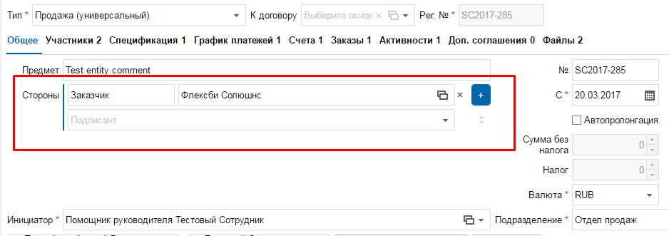

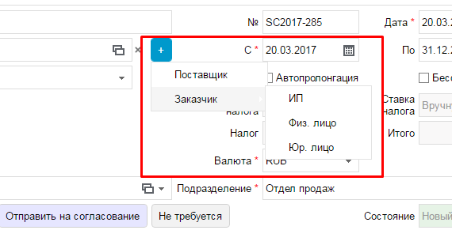

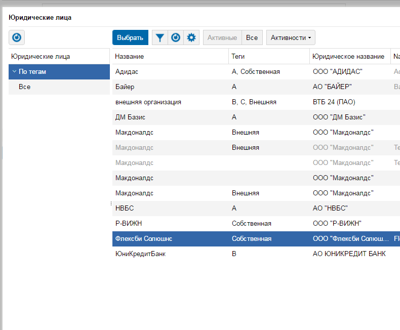

addMember
~~~~~~~~~
Совершает переход во вкладку "Участники" и добавляет участника в документ.
Принимает обязательные параметры, такие как: ФИО участника в системе, название роли в документе, название типа в роли (сотрудник, группа, пользователь, и т.д.).

.. code-block:: python

	def addMember(self, name, first_group_name='Согласователь', second_group_name='Сотрудник'):
		# Нажимаем Участники
		self.clickTab('Участники')
		printOk("Members button click")
		# Нажимаем Добавить
		self.clickByXPATH(add_button_xpath)
		printOk("Add button click")
		# Нажимаем на роль
		self.clickByXPATH(qx_menu_menu_select_xpath % first_group_name)
		# Нажимаем на тип в роли
		self.clickByXPATH(qx_menu_menu_select_xpath % second_group_name)
		printOk("Position button click")
		# Выбираем участника
		self.clickByXPATH(reference_xpath % name)
		self.clickByID('choose')
		# Нажимаем закрыть окно
		self.clickByID('close')

addMembersAndDelete
~~~~~~~~~~~~~~~~~~~
Совершает переход во вкладку "Участники" и добавляет участника в документ, после чего удаляет его.
Принимает обязательные параметры, такие как: ФИО участника в системе, название роли в документе, название типа в роли (сотрудник, группа, пользователь, и т.д.).

.. code-block:: python

	def addMembersAndDelete(self, first_group_name='Инициатор', second_group_name='Исполнитель'):
		# Нажимаем Участники
		self.clickTab('Участники')
		printOk("Members button click")
		# Нажимаем Добавить
		self.clickByXPATH(add_button_xpath)
		printOk("Add button click")
		# Нажимаем Инициатор
		self.clickByXPATH(qx_menu_menu_select_xpath % first_group_name)
		# Нажимаем Сотрудник
		self.clickByXPATH(qx_menu_menu_select_xpath % 'Сотрудник')
		printOk("Position button click")
		# Выбираем Генерального директора
		self.clickByXPATH(cell_in_table_xpath % 'Генеральный директор')
		self.clickByID('choose')
		printOk("Choose director")
		# Нажимаем закрыть окно
		self.clickByID('close')
		printOk("Close window")
		# Нажимаем Добавить
		self.clickByXPATH(add_button_xpath)
		printOk("Add button click")
		# Нажимаем Исполнитель
		self.clickByXPATH(qx_menu_menu_select_xpath % second_group_name)
		# Нажимаем Группа
		self.clickByXPATH(qx_menu_menu_select_xpath % 'Группа')
		printOk("Position button click")
		# Выбираем Логистика
		self.clickByXPATH(cell_in_table_xpath % 'Логистика')
		self.clickByID('choose')
		printOk("Choose logistic")
		# Нажимаем закрыть окно
		self.clickByID('close')
		printOk("Close window")
		# Выбираем Логистику
		self.clickByXPATH(cell_in_table_xpath % second_group_name)
		printOk("Choose logistic")
		# Нажимаем удалить
		self.clickByID('delete')
		# Нажимаем ОК
		self.clickByXPATH(ok_delete_button_window_xpath)
		printOk("OK button click")

addSimpleActivity
~~~~~~~~~~~~~~~~~
Переходит во вкладку "Активности" и добавляет активность.

.. code-block:: python

	def addSimpleActivity(self):
		# Нажимаем Активности
		self.clickTab('Активности')
		printOk("Activities button click")
		# Нажимаем Добавить
		self.clickByID('new')
		printOk("Add button click")
		# Вводим тип Активности
		self.fillAttributes(documentTypeID=activities_activity_type_name)
		# Выбираем тип Активности
		self.clickInPopupMenu(activities_activity_type_name)
		printOk("Choose activity type")
		# Нажимаем OK
		self.clickByID('okb')
		printOk("OK button click")

addSimpleContract
~~~~~~~~~~~~~~~~~
Переходит во вкладку "Договоры" и добавляет договор.

.. code-block:: python

	def addSimpleContract(self):
		# Проверяем на отсутвие shadow
		self.waitNoShadow()
		printOk("NO shadow")
		# Нажимаем Договоры
		self.clickTab(name='Договоры')
		printOk("Contracts button click")
		# Нажимаем Добавить
		self.clickByID('new')
		printOk("Add button click")
		# Находим поле Типа документа и Вводим тип
		self.fillAttributes(documentTypeID=contracts_type_name)
		# Находим и нажимаем в списке нужный тип документа
		self.clickInPopupMenu(contracts_type_name)
		printOk("Choose type")
		# Проставляем дату документа
		self.clickByID('docDate')
		self.fillAttributes(docDate=TakeDate.today)
		self.clickByID('processID.stateID')
		# Закрываем договор
		self.clickByID('okb')
		printOk("Close contract")

addSimpleInvoice
~~~~~~~~~~~~~~~~
Добавляет счёт внутри документа без привязки договора внутри счёта.

.. code-block:: python

	def addSimpleInvoice(self):
		# Проверяем на отсутвие shadow
		self.waitNoShadow()
		printOk("NO shadow")
		# Нажимаем Счета
		self.clickTab('Счета')
		printOk("Invoices button click")
		# Нажимаем Добавить
		self.clickByID('new')
		printOk("Add button click")
		# Закрываем счёт
		self.clickByID('okb')
		printOk("Invoices close")

addSimpleInvoiceWithContract
~~~~~~~~~~~~~~~~~~~~~~~~~~~~
Добавляет счёт внутри документа с привязкой договора внутри счёта.

.. code-block:: python

	def addSimpleInvoiceWithContract(self):
		# Проверяем на отсутвие shadow
		self.waitNoShadow()
		printOk("NO shadow")
		# Нажимаем Счета
		self.clickTab(name='Счета')
		printOk("Invoices button click")
		# Нажимаем Добавить
		self.clickByID('new')
		printOk("Add button click")
		# Находим поле Типа счёта и Вводим тип
		account_type_name_u = str(account_type_name)
		self.fillAttributes(planTypeID=account_type_name_u)
		# Находим и нажимаем в списке нужный тип счёта
		self.clickInPopupMenu(account_type_name_u)
		printOk("Choose document type")
		# Нажимаем на кнопку для выбора договора и выбираем необходимый.
		self.chooseReferenceInWindow('parentID', contracts_type_name)
		# Закрываем счёт
		self.clickByID('okb')
		printOk("Invoices close")

addSimpleProcurement
~~~~~~~~~~~~~~~~~~~~
Добавляет закупку в документе.

.. code-block:: python

	def addSimpleProcurement(self):
		# Проверяем на отсутвие shadow
		self.waitNoShadow()
		printOk("NO shadow")
		# Нажимаем Закупки
		self.clickTab(name='Закупки')
		printOk("Procurement button click")
		# Нажимаем Добавить
		self.clickByID('new')
		printOk("Add button click")
		# Проставляем дату документа
		self.clickByID('docDate')
		self.fillAttributes(docDate=TakeDate.today)
		# Закрываем Закупки
		self.clickByID('okb')
		printOk("Close Procurement")

addTag
~~~~~~
Функция кликает по "Добавить тег", добавляет тег с переданным именем, закрывает окно тегов, после чего удаляет добавленный тег.

.. code-block:: python

	def addTag(tag_name)

addTestFolderInFiles
~~~~~~~~~~~~~~~~~~~~
Эта функция добавляет папку в разделе "Файлы", предварительно вызвав **waitNoShadow** и выполнив переход в сам раздел.

.. note:: Более подробное описание каждого действия можно прочить в исходном коде.

.. code-block:: python

	def addTestFolderInFiles()

addTestTemplateInFiles
~~~~~~~~~~~~~~~~~~~~~~
Добавляет файл по шаблону в разделе "Файлы" внутри документа.

.. code-block:: python

	def addTestTemplateInFiles(self, template_name):
		# Проверяем на отсутвие shadow
		self.waitNoShadow()
		printOk("NO shadow")
		# Нажимаем Файлы
		self.clickTab('Файлы')
		printOk("Files button click")
		# Нажиаем Добавить
		self.clickByXPATH(add_file_button_xpath)
		printOk("Add button click")
		# Добавить Папку
		self.clickByXPATH(qxmenu_button_xpath % "По шаблону")
		printOk("Add template button click")
		# Click in popup menu
		self.clickByXPATH(qxmenu_button_xpath % template_name)
		printOk("Add template button click")
		# Нажимаем Ок
		self.clickByXPATH(ok_delete_button_window_xpath)
		printOk("OK button click")

checkVisibility
~~~~~~~~~~~~~~~
Ждёт появления элемента на странице.

Необходимо передать точный **xpath** элемента.

.. code-block:: python

	def checkVisibility(self, xpath):
		self.wait.until(EC.element_to_be_clickable((By.XPATH, xpath)))

chooseReferenceInWindow
~~~~~~~~~~~~~~~~~~~~~~~
Эта функция позволяет выбрать объект связи в окне, просто передав **id** поля в которое нужно проставить значение и имя объекта в списке.

.. code-block:: python

	def chooseReferenceInWindow(self, reference_id, text):
		# Нажимаем на кнопку выбора
		self.clickByID(reference_id, "//div[@id = 'choose-button']")
		printOk("Select button click")
		time.sleep(SleepSeconds.TWO)
		# Выбираем из списка
		self.clickByXPATH(reference_obj_xpath.format(text=text))
		self.clickByID('choose')
		printOk("Choose contract")

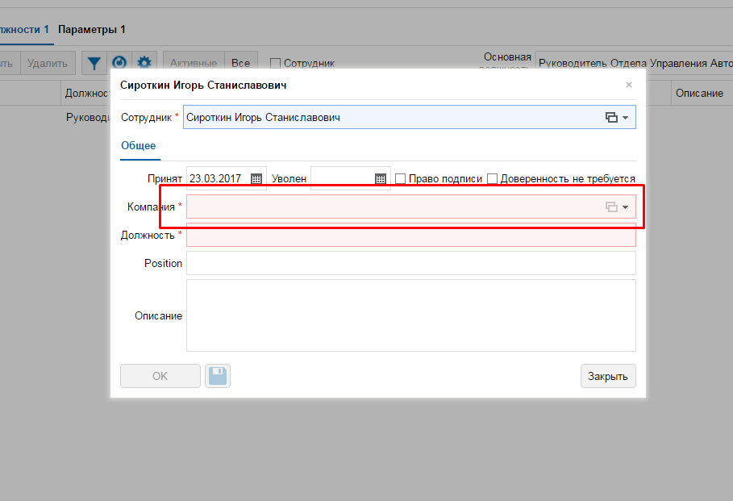

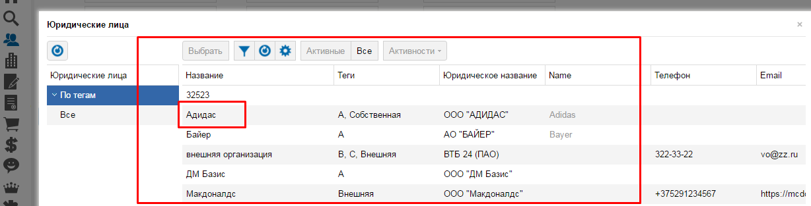

clearByID
~~~~~~~~~
Очищает содержимое элемента (input, textarea).
Необходимо передать **id** элемента и, если это требуется, **xpath** родителя и ребёнка.

.. code-block:: python

	def clearByID(self, element_id, child_xpath='', parent_xpath=''):
		self.driver.find_element_by_xpath(
			attribute_xpath.format(parent=parent_xpath, child=child_xpath, id=element_id)).clear()

click_arrow_down
~~~~~~~~~~~~~~~~
Клик стрелки вниз.

.. code-block:: python

	def click_arrow_down(self, value):
		i = value
		while i != 0:
			self.action.send_keys(Keys.ARROW_DOWN).perform()
			i -= 1
		time.sleep(1)

clickByID
~~~~~~~~~
Клик по элементу через **id**, используя **attribute_xpath**.

Так же можно передать **xpath** родителя или ребёнка.

.. code-block:: python

	def clickByID(self, element_id, child_xpath='', parent_xpath=''):
		self.clickByXPATH(attribute_xpath.format(id=element_id, child=child_xpath, parent=parent_xpath))

clickByXPATH
~~~~~~~~~~~~
Клик по элементу через **xpath**.

.. code-block:: python

	def clickByXPATH(self, xpath):
		self.wait.until(EC.element_to_be_clickable((By.XPATH, xpath)), TextColors.FAIL + "Can't click element = " + TextColors.WARNING + xpath + TextColors.ENDC).click()
		time.sleep(SleepSeconds.ONE)

.. note:: В случае ошибки в консоль будет выведен xpath элемента по которому пыталось совершить клик. После каждого клика стоит ожидание в одну секунду для корректной работы тестов.

clickInPopupMenu
~~~~~~~~~~~~~~~~
Клик по элементу внутри выпадающего меню (@class = **'qx-popup'**).

.. code-block:: python

	def clickInPopupMenu(self, element_name):
		self.clickByXPATH(popup_menu_select_xpath % element_name)
		time.sleep(SleepSeconds.ONE)

.. note:: Передаваемый текст должен полностью совпадать с тем, по которому вы хотите совершить клик.

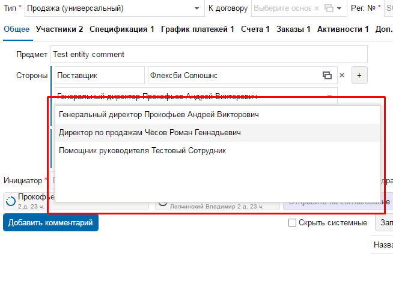

clickInWindowByIDKey
~~~~~~~~~~~~~~~~~~~~
Клик по элементу через **id**, используя **window_attribute_xpath**.

По сути эта функция индентична clickByID, но с изменнёным xpath для работы с элементами в окне (@class = 'qx-window').

Можно вызвать и просто clickByID, передав туда xpath окна, как родителя, но для облегчения написания кода, это было вынесено в отдельную функцию.

.. code-block:: python

	def clickInWindowByIDKey(self, element_id, child_xpath=''):
		self.clickByXPATH(window_attribute_xpath.format(id=element_id, child=child_xpath))

Тут так же можно передать дочерний **xpath**.

*Пример:*

.. code-block:: python

	self.toolkit.clickInWindowByIDKey('choose')

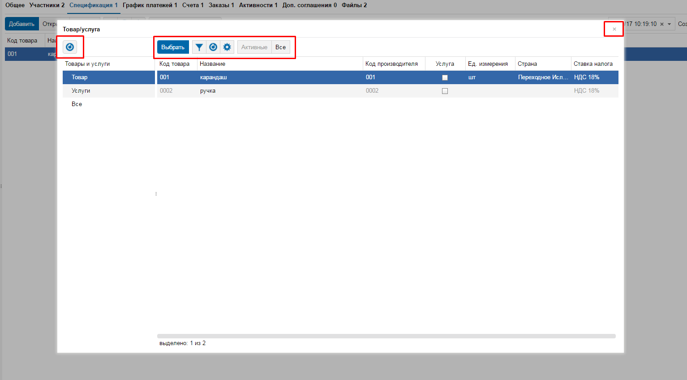

clickTab
~~~~~~~~
Клик по вкладке в меню объекта. Необходимо передать только имя (текст) вкладки меню.

.. code-block:: python

	def clickTab(self, name):
		self.clickByXPATH(tab_xpath.format(name=name))

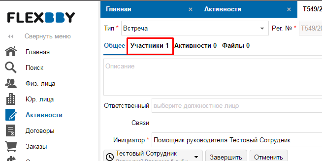

createSimpleBankObject
~~~~~~~~~~~~~~~~~~~~~~
Данная функция нажимает "Добавить" в Банковских рекризитах, заполняет значения и выходит, нажатием **ОК**.

.. note:: Передавть значения в словарь(kwargs) можно на примере addBankAccount.

.. code-block:: python

	def createSimpleObject(self, **kwargs):
		# Нажимаем Добавить
		self.clickByID('BankAccount_objectID', '//div[@id="new"]')
		printOk("Add button click")
		self.fillAttributes(**kwargs)
		# Нажимаем ОК
		time.sleep(SleepSeconds.ONE)
		self.clickByXPATH(ok_button_window_xpath)
		printOk("OK button click")

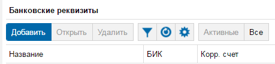

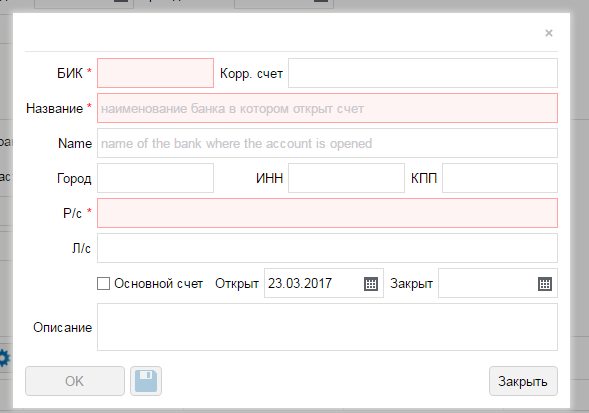

delete_in_table
~~~~~~~~~~~~~~~
Удаляет уже выбранный элемент в таблице.

.. code-block:: python

	def delete_in_table(self):
		# Удаить договор
		self.clickByID('delete')
		printOk("Delete document")
		# Нажимаем ОК
		self.clickByXPATH(ok_delete_button_window_xpath)
		printOk("ОК click")

delete_into_doc
~~~~~~~~~~~~~~~
Удаляет документ (внутри документа через кнопку).

.. code-block:: python

	def delete_into_doc(self):
		# Удаить договор
		self.clickByID('deleteb')
		printOk("Delete document")
		# Нажимаем ОК
		self.clickByXPATH(ok_delete_button_window_xpath)
		printOk("OK click")

deleteMember
~~~~~~~~~~~~
Переходи в раздел "Участники" и удаляет участника в документе.

.. code-block:: python

	def deleteMember(self, cell_name):
		# Нажимаем Участники
		self.clickTab('Участники')
		printOk("Members button click")
		# Выбираем ячейку с именем
		self.clickByXPATH(cell_in_table_xpath % cell_name)
		printOk("Choose logistic")
		# Нажимаем удалить
		self.clickByID('delete')
		# Нажимаем ОК
		self.clickByXPATH(ok_delete_button_window_xpath)
		printOk("OK button click")

deleteObj
~~~~~~~~~
Удаляет сслыку на объект в преданном разделе.

Достаточно просто передать имя раздела.

Функция сама перейдёт в райздел, найдёт ссылку, нажмёт кнопки "Удалить" и "ОК"

.. code-block:: python

	def deleteObj(obj_name)

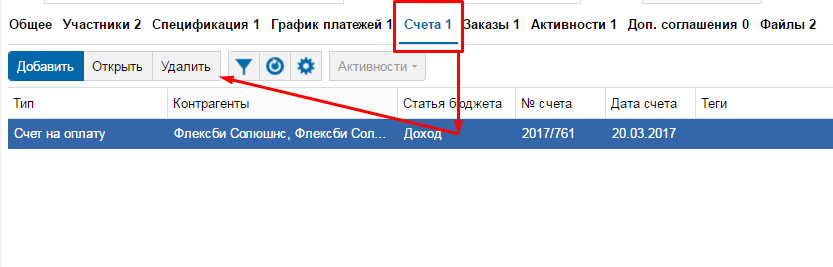

fillAttributes
~~~~~~~~~~~~~~
Заполняет данные в элементы с помощью формируемого словоря ключей (**id** элементов) и значений.

Так же можно передать родительский или дочерний xpath (Используется, когда на странице есть несколько элементов с один **id**).

.. code-block:: python
	:emphasize-lines: 4

	def fillAttributes(self, parent_xpath='', child_xpath='', **kwargs):
		for k, v in kwargs.items():
			self.sendKeysByXPATH(attribute_xpath.format(child=child_xpath, parent=parent_xpath, id=k), v)
			printOk("Enter " + k)

.. note:: В данной функции уже реализован вывод в консоль с помощью **printOk**.

*Пример вызова:*

.. code-block:: python

	# Проставляем дату документа в элемент с id == docDate
	self.toolkit.fillAttributes(docDate=TakeDate.today)

fillParameter
~~~~~~~~~~~~~
Заполняет параметры в документе. Находит ячейку с именем параметра, после чего делает фокус на соответствующую для ввода данных (поиск необходимой ячейки реализован через прародителя из за особенной структуры тиблицы параметров в системе Flexbby.

.. code-block:: python

	def fillParameter(self, param_name, input_text):
		# Находим в столбце с названиями параметров нужный и возвращаем его третьего родителя
		param_line = self.driver.find_element_by_xpath(
			"//div[@id='DocumentParameterValue_objectID']//parent::div[@class='qx-table-row']//span[text()='%s']" % param_name
		).find_element_by_xpath('../../..')
		printOk("Find target row with name = " + TextColors.HEADER + param_name + TextColors.ENDC)
		# Находим всю строчку
		rows = param_line.find_elements_by_xpath('../*')
		# Добавляем единицу к индексу. Необходимо будет для определения соответвующей строчки напротив строки с названием.
		indexOfTarget = rows.index(param_line) + 1
		printOk("Index of target = " + TextColors.HEADER + str(indexOfTarget) + TextColors.ENDC)
		# Находим ячейку значения
		value_clm = "//div[@id='DocumentParameterValue_objectID']/div[2]/div[1]/div[2]/div[2]/div[1]/div[1]/div[%s]/div[1]" % indexOfTarget  # <---- %s передавать indexOfTarget
		# Клип по ячейке для активации
		self.clickByXPATH(value_clm)
		printOk("Click on 'Value' column")
		# Внутри ячейки находим инпут и проставляем значение
		self.driver.find_element_by_xpath(
			"//div[@id='DocumentParameterValue_objectID']//div[@class='qx-table-scroller-focus-indicator']//input").send_keys(
			input_text)
		printOk('Send keys')
		# Enter
		self.action.send_keys(Keys.ENTER)
		printOk('Enter click')
		# Нажимаем кнопку Добавить Комментарий
		self.clickByID('newCommentButton')
		printOk("Add Comment button click")
		# Вводим первый комментарий
		self.fillAttributes(commentInput='Параметр ' + param_name + ' был заполнен')
		# Нажимаем Сохранить
		self.clickByID('saveComment')
		printOk("Save button click")

findElement
~~~~~~~~~~~
Находит(делает фокус) ячейку в таблице с текстом.

.. code-block:: python

	def findElement(self, text):
		self.driver.find_element_by_xpath(cell_in_table_xpath % text).location_once_scrolled_into_view()

inputByID
~~~~~~~~~
Очищает поле и вносит данные по id элемента

.. code-block:: python

	def inputByID(self, element_id, text):
		search_element = self.driver.find_element_by_id(element_id)
		printOk("Find element by ID == '" + TextColors.BOLD + element_id + TextColors.ENDC + "'")
		search_element.clear()
		printOk("Clear")
		search_element.send_keys(text)
		printOk("Enter text == '" + TextColors.BOLD + text + TextColors.ENDC + "'")

login
~~~~~
Используется для входа в систему. Заполняет login, password и клик по кнопке "Вход".

.. code-block:: python

	def login(self, login, password)

quit
~~~~
Закрывает браузер.

.. code-block:: python

	def quit(self)

sendKeysByXPATH
~~~~~~~~~~~~~~~
Данная функция является одной из основных для простановки значений внутри тестирования системы Flexbby.

.. code-block:: python

	def sendKeysByXPATH(self, xpath, keys):
		el = self.wait.until(EC.element_to_be_clickable((By.XPATH, xpath)))
		if el.tag_name == 'input':
			el.send_keys(keys)
		elif el.tag_name == 'textarea':
			el.send_keys(keys)
		elif el.tag_name == 'div':
			el = el.find_element_by_xpath(".//input")
			if el != None:
				el.send_keys(keys)
		elif el.tag_name == 'div':
			el = el.find_element_by_xpath(".//textarea")
			if el != None:
				el.send_keys(keys)
		else:
			print(TextColors.FAIL + 'Error to find element' + TextColors.ENDC)

Находит элемент по xpath на странице.

.. code-block:: python

	el = self.wait.until(EC.element_to_be_clickable((By.XPATH, xpath)))

Проставляет значение, если элемент является **input**

.. code-block:: python

	if el.tag_name == 'input':
		el.send_keys(keys)

Проставляет значение, если элемент является **textarea**

.. code-block:: python

	elif el.tag_name == 'textarea':
		el.send_keys(keys)

Если переданный элемент является **div**, то проверяет на наличие в нём **input**. Если **input** присутствует, то в него проставится значение.

.. code-block:: python

	elif el.tag_name == 'div':
		el = el.find_element_by_xpath(".//input")
		if el != None:
			el.send_keys(keys)

Если переданный элемент является **div**, то проверяет на наличие в нём **textarea**. Если **textarea** присутствует, то в него проставится значение.

.. code-block:: python

	elif el.tag_name == 'div':
		el = el.find_element_by_xpath(".//textarea")
		if el != None:
			el.send_keys(keys)

Вывод ошибки, ели не обнаружен подходящий элемент.

.. code-block:: python

	else:
		print(TextColors.FAIL + 'Error to find element' + TextColors.ENDC)

setSite
~~~~~~~
Передаёт URL сайта драйверу.

.. code-block:: python

	def setSite(self, url):
		self.driver.get(url)

.. note:: Необходимо передавать полный URL сайта в формате string.

takeDocID
~~~~~~~~~
Данная функция находит в URL **id** документа в системе Flexbby.

.. code-block:: python

	def takeDocID(self):
		url = self.driver.current_url
		hash_tag = url[url.find('#') + 1:]
		params = dict(x.split('=') for x in hash_tag.split('&'))
		obj_id = params['id']
		return obj_id

treeClick
~~~~~~~~~
Клик в дереве (слева таблицы) по тексту.

.. code-block:: python

	def treeClick(self, tree_name):
		# Нажимаем рефлеш
		self.clickByID('tree-toolbar', "//div[@class='qx-button-common-border']")
		# Нажимаем на необходимый классификатор в дереве
		tree_name = str(tree_name)
		self.clickByID('tree-virtual', "//span[text()='%s']" % tree_name)

visibilityOfAnyElem
~~~~~~~~~~~~~~~~~~~
Ждёт появления на странице элемента с переданным **id**.

.. code-block:: python

	def visibilityOfAnyElem(self, docID):
		self.wait.until(EC.visibility_of_any_elements_located((By.ID, docID)))

waitNoShadow
~~~~~~~~~~~~
Данная функция ждёт, пока элемент **shadow** получит состояние **invisibility**.

Используется после закрытия окна, чтобы убедиться, что другие элементы на основной странице стали доступны.

.. code-block:: python

	def waitNoShadow(self):
		self.wait.until(EC.invisibility_of_element_located((By.ID, 'shadow')))
		time.sleep(SleepSeconds.TWO)

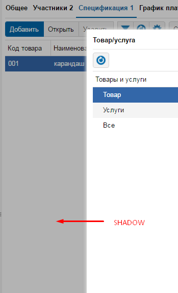

XPATH
-----
В вышеприведенных функциях используются различные селекторы.

Вот самые основные из них:

.. code-block:: python

	attribute_xpath = "{parent}//*[@id = '{id}' and not(ancestor::div[contains(@style," \
				  "'display:none')])and not(ancestor::div[contains(@style,'display: none')])and not(div[contains(@style," \
				  "'display:none')])and not(div[contains(@style,'display: none')])]{child}"

.. code-block:: python

	window_attribute_xpath = "//div[@class = 'qx-window']//*[@id = '{id}' and not(ancestor::div[contains(@style," \
						 "'display:none')])and not(ancestor::div[contains(@style,'display: none')])and not(div[contains(@style," \
						 "'display:none')])and not(div[contains(@style,'display: none')])]{child}"

.. code-block:: python

	popup_menu_select_xpath = "//div[@class='qx-popup' and not(contains(@style," \
						  "'display:none'))and not(contains(@style,'display: none'))]//div[text()='%s']"

.. code-block:: python

	qx_menu_menu_select_xpath = "//div[@class='qx-menu-border' and not(ancestor::div[contains(@style," \
							"'display:none')])and not(ancestor::div[contains(@style,'display: none')])]//div[text(" \
							")='%s']"

.. code-block:: python

	cell_in_table_xpath = "//div[@class = 'qooxdoo-table-cell' and(text()='%s') and not(" \
					  "ancestor::div[contains(@style," \
					  "'display:none')])and not(ancestor::div[contains(@style,'display: none')])]"

.. code-block:: python

	reference_obj_xpath = "//div[@class='qx-window'and not(div[contains(@style, 'display:none')])and not(div[contains(@style,'display: none')])]//div[@class = 'qooxdoo-table-cell' and(text()='{text}')]"

.. code-block:: python

	dialog_attribute_xpath = "//div[@class = 'qx-window' and not(ancestor::div[contains(@style," \
						 "'display:none')])and not(ancestor::div[contains(@style,'display: none')])]//*[@id = '{id}']"

.. code-block:: python

	tab_xpath = "//div[@class = 'qx-flexbby-tabview-button-underlined']//div[contains(text(),'{name}')and " \
			"not(ancestor::div[contains(@style," \
			"'display:none')])and not(ancestor::div[contains(@style,'display: none')])]"

.. warning:: Любые изменения в проекте rootsLib должны быть задокументированы в данной инструкции.